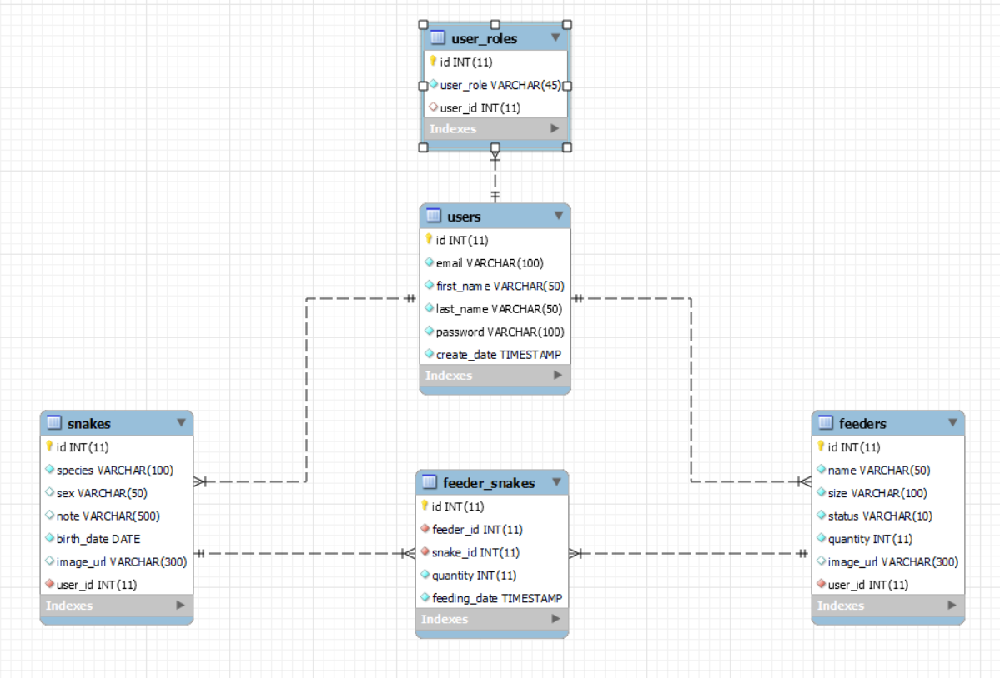
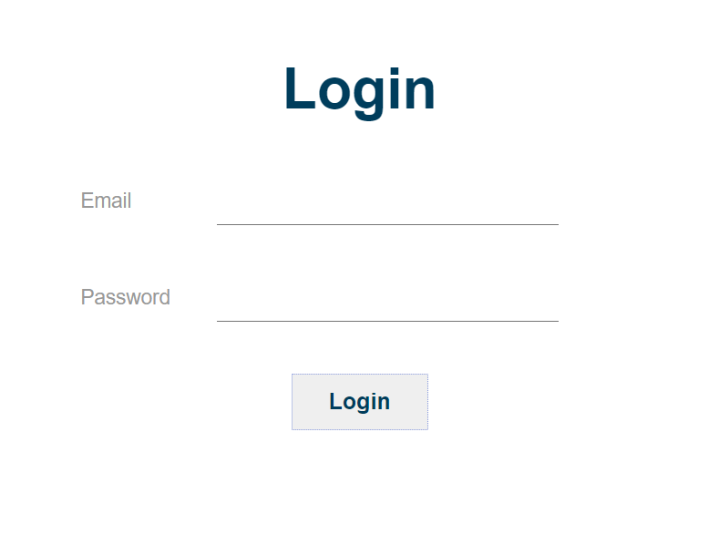
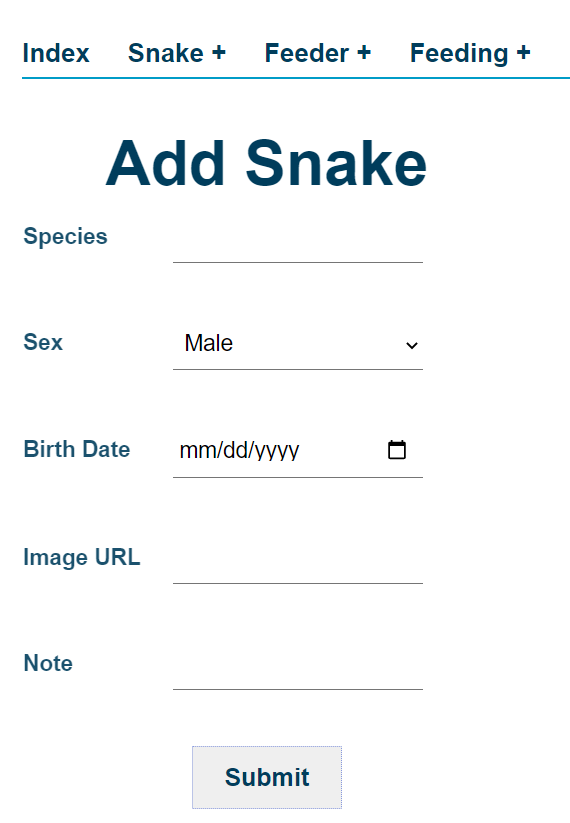
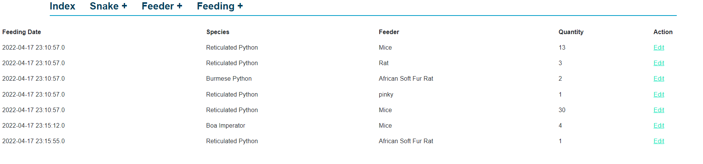

# Snake Management System

# Description
This app allows user to:
- create an account
- authenticated user can add a snake, see all snakes, and search for snakes into their collection
- authenticated user can add a feeder, see all feeders, and search for feeder into their stock
- anthenticated user can add a feeding (feed feeder to a snake), see past feedings

### Planning Story
#### User stories
- as an anonymous user,  I want to create a new account
- as an authenticated user, I want to sign in with email and password
- as an authenticated user, I want to create an entry for a snake
- as an authenticated user, I want to see all my snakes
- as an authenticated user, I want to be able to search for a snake
- as an authenticated user, I want to create an entry for a feeder
- as an authenticated user, I want to see all my feeders
- as an authenticated user, I want to search for a feeder
- as an authenticated user, I want to create a feeding for my snake
- as an authenticated user, I want to see past feedings

#### Entity Relationship Diagram (ERD)

#### App Images

### Stretch Goals
- Able to calculate a snake's age dynamically in days, months, years.
- Color code card for males and females
- Add feeding cycle when create an entry for a new snake
- Feeding cycle will automatically count down and will show reminder when it is approaching 0
- Able to show breeding-pair information (who had and is bred with whom)
